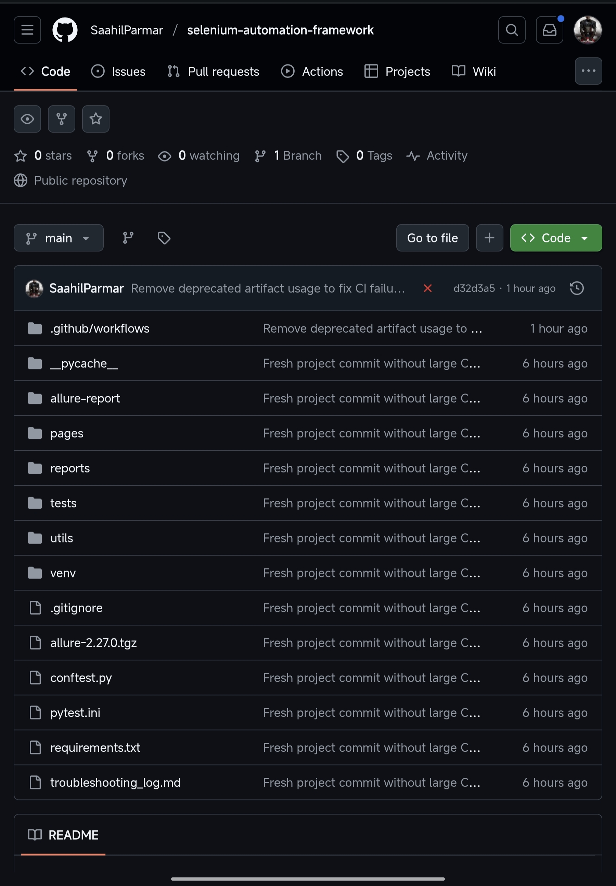
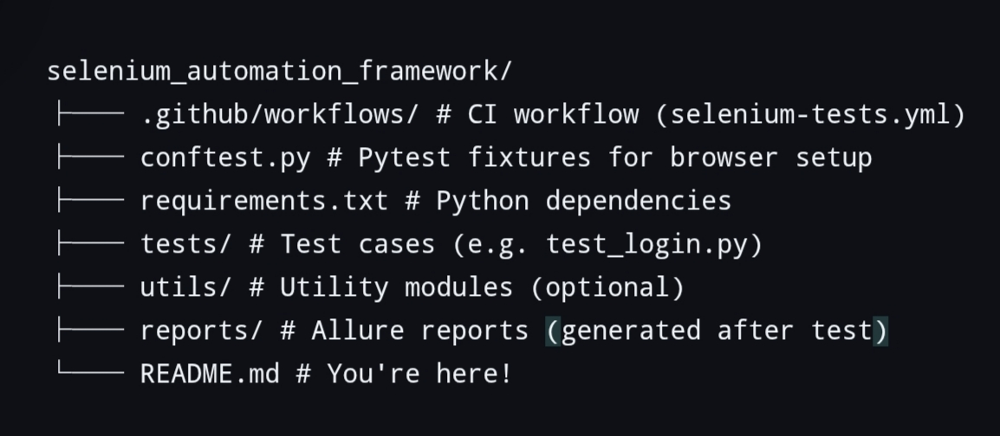

# Selenium Automation Framework ✅

A complete **Selenium + Pytest test automation framework** designed for cross-browser testing, Allure reporting, and CI/CD integration with GitHub Actions.


## 1. 📁 Project Structure





selenium_automation_framework/
├── .github/workflows/ # CI workflow (selenium-tests.yml)
├── conftest.py # Pytest fixtures for browser setup
├── requirements.txt # Python dependencies
├── tests/ # Test cases (e.g. test_login.py)
├── utils/ # Utility modules (optional)
├── reports/ # Allure reports (generated after test)
└── README.md # You're here!


## 2. 🧠 Features of This Framework

1. ✅ Modular Pytest + Selenium setup
2. ✅ CLI browser and headless test control
3. ✅ Cross-platform ready (Linux, Codespaces, Local)
4. ✅ Allure reporting support
5. ✅ GitHub Actions CI/CD integration
6. ✅ Professional error handling and logging
7. ✅ Easily extendable for large teams or real-world use


## 3. 🚀 Setup Instructions


### 3.1 Clone the Repository
```bash
git clone https://github.com/YOUR_USERNAME/selenium-automation-framework.git
cd selenium-automation-framework
```

### 3.2 Create and Activate Virtual Environment
```bash
python3 -m venv venv
source venv/bin/activate
```

### 3.3 Install Dependencies
```bash
pip install -r requirements.txt
```
## 4. 🧪 Running the Tests


### 4.1 Basic Test Run (Chrome + Headless)
```bash
pytest --browser chrome --headless --alluredir=reports/
```

### 4.2 Run with Visible Browser (Non-headless)
```bash
pytest --browser chrome --alluredir=reports/
```
## 5. 📊 View Allure Report


> Make sure you have Allure installed:
> [Installation Guide → https://docs.qameta.io/allure/]

### 5.1 To Serve the Report:
```bash
allure serve reports/
```

This opens an interactive test report in your browser.
## 6. 🛠 Available CLI Options


| Argument        | Description                                | Example                       |
|-----------------|--------------------------------------------|-------------------------------|
| `--browser`      | Browser to run tests (e.g., chrome)        | `--browserchrome`            |
| `--headless`     | Run without UI                             | `--headless`                 !
| `--alluredir`    | Directory to save Allure results           | `--alluredir=reports`        |

## 7. 🔄 CI/CD Integration (GitHub Actions)

This project includes a CI workflow located at:

```
.github/workflows/selenium-tests.yml
```

It runs on every push to `main`:
- ✅ Sets up environment
- ✅ Installs dependencies
- ✅ Runs headless tests
- ✅ Optionally uploads results

> To trigger: simply `git push` your code!
## 8. 🐛 Troubleshooting

All known errors and solutions have been logged in:

```
troubleshooting_log.md
```


This includes:
- Chromedriver errors
- NoSuchElement exceptions
- GitHub Actions failures
- Push errors and LFS issues
## 9. 🖼️ Screenshots


### 9.1 Allure Report Sample:
*(Place your screenshot in `assets/` folder and reference it)*


## 10. 📌 Dependencies

- `selenium`
- `pytest`
- `webdriver-manager`
- `allure-pytest`

Install all using:
```bash
pip install -r requirements.txt
```
## 11. 🔖 License

This project is licensed under the **MIT License**.
Feel free to modify and use for educational or professional use.
## 12. 👨‍💻 Author

**Saahil Parmar**
Test Automation Engineer in Progress 💻
_Reach out via GitHub for collaboration or questions!_
